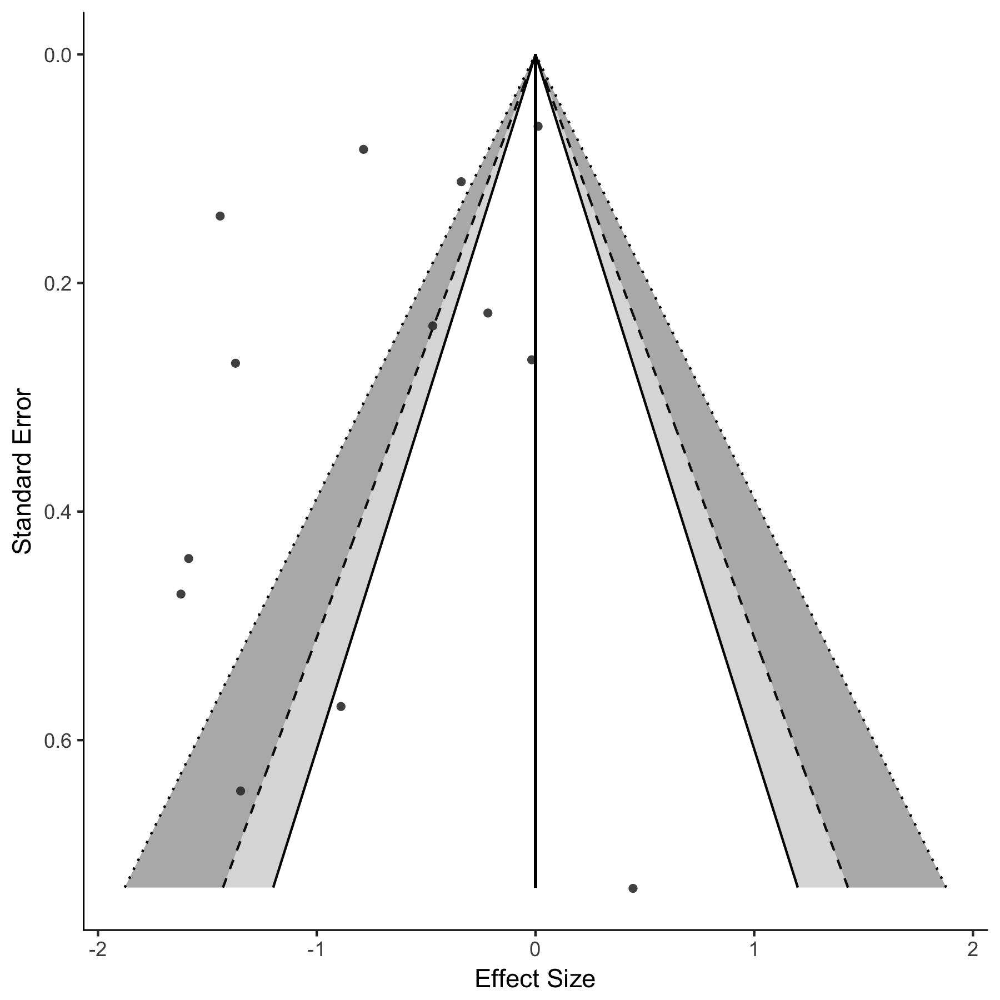

# ce-funnel
CE.funnel() is a function for producing ggplot2()-based (Wickham, 2009) contour-enhanced funnel plots, using models fit with the metafor() package (Viechtbauer, 2010). 

## Authors
[John K. Sakaluk](https://github.com/jsakaluk)(@JohnSakaluk)

## Development

For now, this is a stand-alone function. It may eventually become integrated in the metafor() package.

## Prerequisites

You will need to have the metafor() and ggplot2() packages installed 

```
install.packages("metafor")
install.packages("tidyverse")
```

## Example

First save the output of a fitted metafor() model. Then, run CE.funnel() on the stored metafor() object.
```
library(metafor)
res <- rma(ai=tpos, bi=tneg, ci=cpos, di=cneg, data=dat.bcg, measure="RR",
           slab=paste(author, year, sep=", "), method="REML")
           
CE.funnel(res)
```
